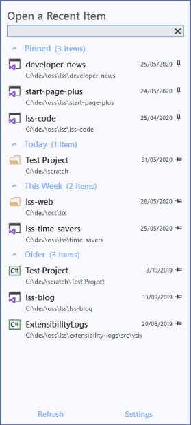

To display the new *Start Page+* window:

- click **View** | **Start Page+**

## Recent Items

The *Recent Items* list brings back the ability to filter the list of recent items, and the grouping by timeframe
that we had in VS 2017.

### Pin/Unpin Items

Right-click an unpinned item in the *Recent Items* list, and select *Pin item* to pin it. 
Right-click on a pinned item in the *Recent Items* list, and select *Unpin item** to unpin it.

### Remove Items

Right-click any item in the *Recent Items* list, and select *Remove item* to remove it. 

## Start Actions

The *Start Actions* list gives new users a simplified way to get to their code, the same as in VS 2019's
*Start Window*.

- clone or checkout code
- open a local folder
- open a project or solution
- create a new project
- restart Visual Studio
- restart Visual Studio as Administrator

It also has a handy, but non-intrusive way to see what version of *Start Page+* is currently installed.
Clicking on the link will open the *change log* page, 
so you can easily see what's changed in the new version.

## Developer News

The *Developer News* feed brings back VS 2017's handy list of Microsoft developer-related news items that was removed from
VS 2019.
I don't know how many times I've seen something that interests me that I might have missed if I hadn't seen it on my
start page.

By default the items open right in VS itself, rather than switching to the default browser.
Personally, I prefer having to switch applications as little as possible.
When I'm working in Visual Studio, I prefer to stay in Visual Studio, and not have my attention derailed by having
to switch to a different application, and then back again to Visual Studio.

However, for those people who prefer links to be opened in their default browser,
there's an option to change Start Page+'s behavior to do just that.

## General Options

### Enable 'Start Page+'

This setting allows _Start Page+_ to be *turned off*, without having to uninstall the _Start Page+_ extension,
which would require you to exit **all** instances of Visual Studio, wait while the _VSIX installer_ does its thing,
then open Visual Studio again.

If you're worried about the _Start Page+_ extension still using resources, once you enable this setting,
the _View_ | _Start Page+_ and the _Tools_ | _Start Page+ Options_ menu items will no longer be available,
so the extension will have no need to be loaded.

However, instances of any tool window are never _destroyed_ when they're _closed_, so until you close Visual Studio there will
be some remaining resources being used. But the next time you start Visual Studio, there'll be no way to open
the _Start Page+_ window, so the extension will not need to be loaded.

### Version Number

This setting simply displays the version number of _Start Page+_ that's currently installed.

## Feature Options

### Enable 'Open Links in VS'

When this setting is set to `true`, any clicked item that opens a web page will be opened in a browser window
**inside** of Visual Studio.

When set to `false`, clicked items that open a web page will be opened in your default browser.

### Enable 'Start Page+ Options'

When this setting is set to `true` a 'Start Page+ Options' command is added to the `Tools` | `Options` menu.

## Setting Options

### Max Width

The default value of 1175 should be fine for everyone, regardless of your monitor resolution.
However if you'd like the contents of the _Start Page+_ window to be wider or narrower,
this setting will allow you to set it to whatever you prefer.